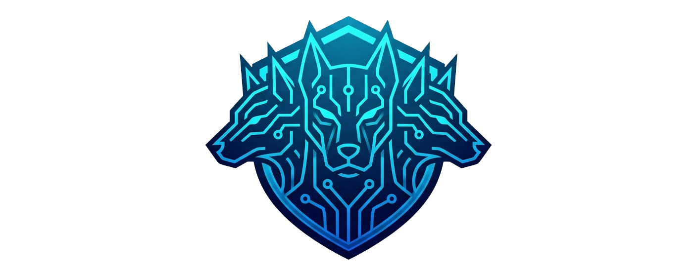
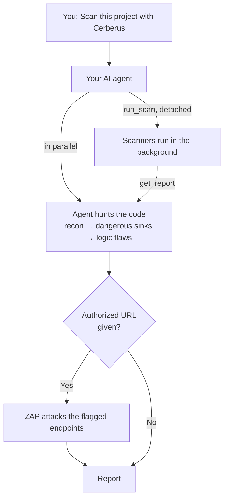

<p align="center">
  
</p>

<h1 align="center">Cerberus-Scan</h1>

Cerberus-Scan is an **MCP server** that hands your AI agent a container full of
security scanners and a playbook for using them. The scanners catch known
patterns: vulnerable dependencies, leaked secrets, risky code and
misconfigurations. Your agent then traces the code itself to find what pattern
matching misses: auth bypasses, IDOR, SSRF, RCE, and broken business logic. If you want proof, it can also attack a running
instance with OWASP ZAP.

Three heads, three layers:

| 🔍 Static analysis | 🔑 Secrets | 💥 Runtime (DAST) |
|---|---|---|
| opengrep, trivy, osv-scanner, checkov, hadolint, actionlint, zizmor | gitleaks, trufflehog (checks if keys are live) | OWASP ZAP active scan, aimed at what the review flagged |

Works with **Claude Code, Codex, Cursor, Copilot CLI, Kiro**, or any MCP client.
The server contains no AI model and needs no API key. Your agent does the thinking.

## ⚡ Quick start

**1. Build the scanner image** (one time, takes a few minutes):

```bash
docker build -t cerberus-scan-scanner:local /abs/path/to/cerberus-scan/mcp_server/scanner_image
```

**2. Add the server to your agent.** For Claude Code:

```bash
claude mcp add cerberus-scan -- uvx --from /abs/path/to/cerberus-scan cerberus-scan-mcp
```

<details>
<summary>Codex, Cursor, Copilot CLI, others</summary>

**Codex** (`~/.codex/config.toml`):

```toml
[mcp_servers.cerberus-scan]
command = "uvx"
args = ["--from", "/abs/path/to/cerberus-scan", "cerberus-scan-mcp"]
```

On Windows, escape backslashes in the path (`"P:\\github\\cerberus-scan"`).
Check it with `codex mcp list`. See the [Codex MCP guide](https://learn.chatgpt.com/docs/extend/mcp).

**Cursor** (`~/.cursor/mcp.json`) and **Copilot CLI** (`.mcp.json`):

```json
{
  "mcpServers": {
    "cerberus-scan": {
      "command": "uvx",
      "args": ["--from", "/abs/path/to/cerberus-scan", "cerberus-scan-mcp"]
    }
  }
}
```

**Anything else:** run `uvx --from /abs/path/to/cerberus-scan cerberus-scan-mcp`.
It speaks MCP over stdio.

</details>

Restart your client afterwards.

**3. Ask your agent:**

```text
Scan this project with Cerberus
```

That's it. Some other things you can ask:

**Scan part of a monorepo:**

```text
Scan the apps/api folder with Cerberus
```

**Scan and validate a running instance:**

```text
Scan this project with Cerberus and validate findings against http://localhost:3000
```

Runtime validation needs the ZAP image first (~3.7 GB, skip it if you only want static scans):

```bash
docker pull ghcr.io/zaproxy/zaproxy:stable
```

> The images aren't built or pulled automatically because doing that inside a
> tool call would hit the agent's timeout. If one is missing, the tool tells you
> the exact command to run.

## 🧠 How it works



- **Nobody waits around.** Scanners run in the background while the agent reads
  the code. It pulls in scanner results as they arrive and follows the leads
  they point to.
- **The agent aims ZAP.** It gives ZAP the real requests it flagged (method,
  path, body, auth headers), so ZAP tests the endpoints that matter instead of
  crawling blindly.
- **Every finding has evidence.** Each one comes with a source-to-sink trace or a
  runtime proof. Anything unverified is dropped or labelled as unverified.
- **Everything is saved** to `.security-scan-output/`, including the full JSON
  inventory and any scanner coverage gaps.

## 🧃 Does it work? Juice Shop results

We ran it against [OWASP Juice Shop](https://owasp.org/www-project-juice-shop/),
an app that is vulnerable on purpose, with runtime validation turned on:

| Critical | High | Medium | Low |
|:-:|:-:|:-:|:-:|
| **9** | **11** | **9** | **3** |

Those findings include JWT algorithm-confusion admin takeover, SQLi login bypass,
NoSQL `$where` code execution, SSRF, cross-account IDOR, sandbox-escape RCE, and
a payment bypass. They sit on top of 489 static scanner hits and 573 ZAP alerts.
📄 [Read the full, unedited report](owasp_juice_shop_scan_results.txt).

> The run used Claude Sonnet 5 at high effort. Results depend on the model
> driving the scan: GPT-5.6 Terra at medium effort found noticeably fewer.

## 🔒 Where your code goes

- The repo is mounted into the container **read-only**.
- The server **sends your code nowhere**.
- `trivy` and `osv-scanner` look up package names and versions online, and
  `trufflehog` tests any secrets it finds against their provider to see if
  they're live. Pass `--network none` to run fully offline.
- Your agent sees the code it reviews, the same as any AI code review. With a
  local model, nothing leaves your machine.
- ZAP only targets local hosts by default. Set `SEC_ALLOW_REMOTE=1` to test a
  remote host, and only do that for **systems you're authorized to test**.

## 🛠️ Development

```
mcp_server/                 MCP tools + workflow instructions
mcp_server/scanner_image/   containerized scanners, runner, SAST rules
methodology/                workflow, class guides, report template, stack playbooks
tests/                      regression tests + scanner smoke checks
```

```bash
python -m unittest discover -s tests -v
```

<details>
<summary>Scanner smoke tests</summary>

```bash
docker run --rm --network none --entrypoint python3 -e PYTHONPATH=/project -v "<repo>:/project:ro" -w /project cerberus-scan-scanner:local tests/scanner_smoke.py
```

To also test Trivy DB downloads and caching, drop `--network none`, add
`-v cerberus-reliability-test-trivy-cache:/cache/trivy`, and append `--online`.
After changing scanner code or rules, rebuild the image and restart your MCP client.

</details>
